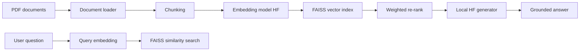

# Architecture (Industry-Style RAG)

## High-level flow

## Components

| Layer | Responsibility |
|--------|----------------|
| **Ingestion** | PDF text extraction (`pdfplumber`) |
| **Processing** | Deterministic chunking with overlap |
| **Embeddings** | Sentence-transformers vectors (normalized) |
| **VectorStore** | FAISS `IndexFlatIP` + JSON metadata sidecar |
| **Retrieval** | Top-K candidates, then `score * document_weight` |
| **LLM** | Local seq2seq / instruct model with strict grounding prompt |
| **App** | Streamlit control plane calling Python services (no HTTP API in core) |

## Data on disk

- `Data/documents/` — source PDFs (governed by optional filename regex).
- `Data/vector_store/index.faiss` — vector index (binary).
- `Data/vector_store/metadata.json` — per-chunk text + labels (protect with ACL/encryption).
- `Data/logs/rag_app.log` — operational logs (no raw user prompts by default in structured future).

## Security model

- **Offline-first:** models loaded from local paths when `OFFLINE_ONLY=true`.
- **No cloud LLM API** in this codebase path.
- **Least privilege:** restrict read/write to project data directories on servers.

## Scaling notes (when you deploy)

- Single-node FAISS is fine up to mid-size corpora; for very large scale, consider sharded indices or a managed vector DB — same retrieval interface can be abstracted behind `VectorStore/`.
